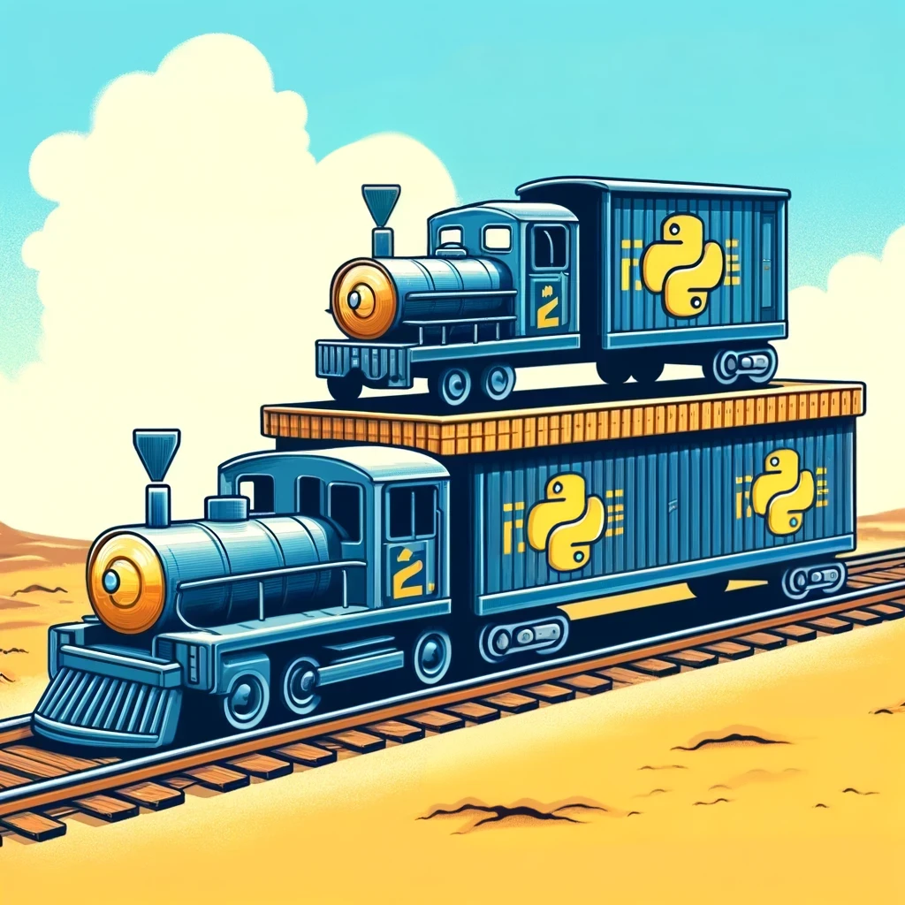

# sdamigtrations

## What is this?

This is a repo used to share code written to make migrations checks easier for a network upgrade from legacy to SDA. The text describing the use case is at <replace with url>

## Nautobot version

Nautobot version is 1.6.7. It can work with version 2.x with some modification. There is a slight problem with the nornir-nautobot package not transporting the platform over to the nornir dynamic inventory generated from Nautobot. It can be remedied with adding the platform dynamically through pynautobot and code modifying Nornir inventory values in runtime.

## Python version

Anything above 3.10 should work.

## Code Quality - Unusual Concepts

The code is still a mess but has been used so it does work. Of course modifications were made to make sure no real data is published on github.

You may have a litle trouble understanding some functions that accept other functions as parameters. It's functions determining the path and carrying over other functions that define tasks to be done on one path or another. The goal is to keep to the DRY principle and allow the code to be extensible.

